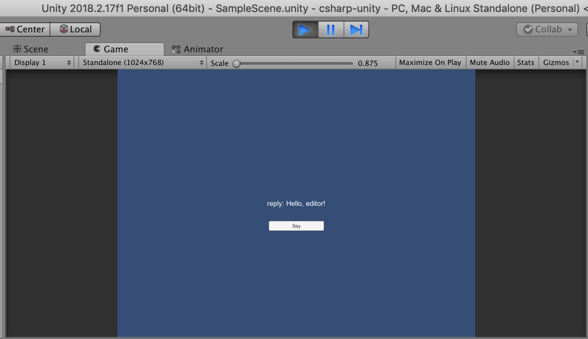

# Unity-GRPC-min

Minimal GRPC unary server/client using Unity as Client.

# Deps

* Make
* Unity 2018.2+
* Python 2


# Arch


## Message+Service

```proto
// The greeting service definition.
service Greeter {
  // Sends a greeting
  rpc SayHello (HelloRequest) returns (HelloReply) {}
}

// The request message containing the user's name.
message HelloRequest {
  string name = 1;
}

// The response message containing the greetings
message HelloReply {
  string message = 1;
}
```

# Build

## Server

    make build-server

Will generate the proto stub layer in server/python/helloworld*.py

## Client

    make build-client

Will generate the proto bridge classes in client/csharp-unity/Assets/GRPC/*


# Run


## Server

    make run-server

Listenning at 50051 port

## Client

On Unity open the project client/csharp-unity and hit Play
The result must be




# Ref

* [packages.grpc.io](https://packages.grpc.io)

* [gRPC with Unity](https://shamaton.orz.hm/blog/archives/553)
