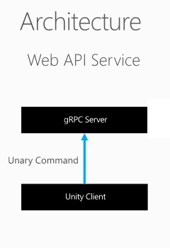
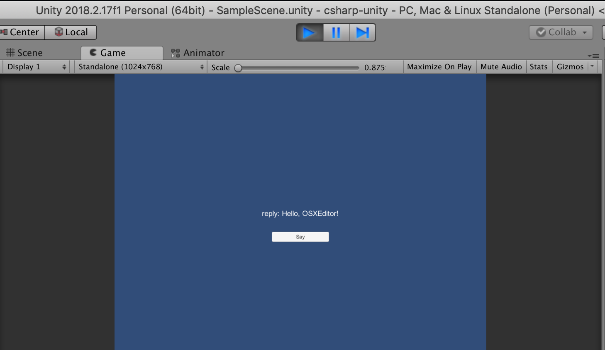

# Unity-GRPC-min

Minimal GRPC unary server/client using Unity as Client.

# Deps

* Make
* Unity 2018.2+
* Python 2


# Arch




## Proto

```proto
// For Unity
option csharp_namespace = "Pj.Grpc.Sample";
package helloworld;

// The greeting service definition.
service Greeter {
  // Sends a greeting
  rpc SayHello (HelloRequest) returns (HelloReply) {}
}

// The request message containing the user's name.
message HelloRequest {
  string name = 1;
}

// The response message containing the greetings
message HelloReply {
  string message = 1;
}
```

## Server

```python
class Greeter(helloworld_pb2_grpc.GreeterServicer):

    def SayHello(self, request, context):
        return helloworld_pb2.HelloReply(message='Hello, %s!' % request.name)
```

## Client

```csharp
    // ...
    public void Say()
    {
        Channel channel = new Channel(ip + ":" + port, ChannelCredentials.Insecure);
        var client = new Greeter.GreeterClient(channel);
        string user = Application.platform.ToString();

        var reply = client.SayHello(new HelloRequest { Name = user });
        Debug.Log("reply: " + reply.Message);
        text.text = "reply: " + reply.Message;

        channel.ShutdownAsync().Wait();
    }
```

# Build

# Dep

    make dep

sudo command will ask for your local password to install protoc

## Server

    make build-server

Will generate the proto stub layer in server/python/helloworld*.py

## Client

    make build-client

Will generate the proto bridge classes in client/csharp-unity/Assets/GRPC/*


# Run


## Server

    make run-server

Listening at 50051 port.

## Client

On Unity open the project client/csharp-unity and hit Play
The result must be




# Ref

* [packages.grpc.io](https://packages.grpc.io)

* [gRPC with Unity](https://shamaton.orz.hm/blog/archives/553)
